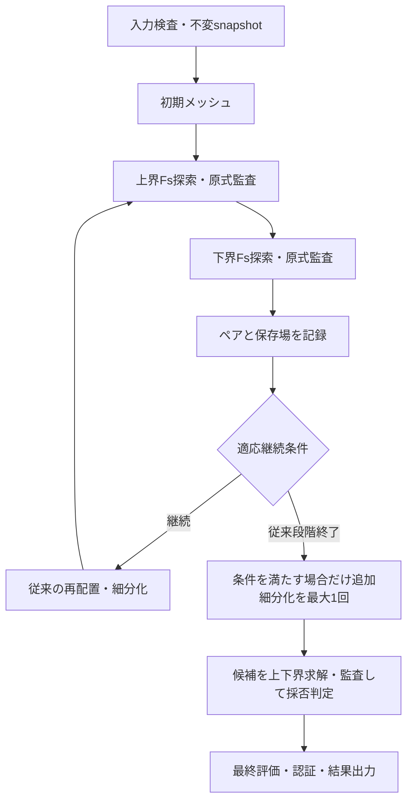

# 解析の原理 — 実装との対応

[README](../README.md) / [使い方](USAGE_JA.md) / [注意事項](NOTES_JA.md)

この説明はG1R12のVBA実装を対象とします。G1R11から構成則・離散化・数値カーネル・監査・許容誤差は変わっていません。一般的な極限解析の考え方と、このコードで実際に使っている離散化・変換・認証を区別しています。

## 1. 何を計算するか

RPFEMはRigid Plastic Finite Element Method、剛塑性有限要素法です。本コードは2次元・単位奥行きの極限解析として、土のMohr–Coulomb強度、領域、拘束、面荷重、自重、必要なら剛体を与え、崩壊に対応する荷重または強度低減係数の数値的な上下界を求めます。

剛塑性モデルでは、崩壊機構と釣合い・降伏条件を扱い、弾性変形の履歴は解きません。この版の材料データはc、φ、ψ、γで、Young率EやPoisson比νを使う弾性変位解析ではありません。上界に出てくる速度は崩壊機構の形を表し、実時間の変位や沈下の予測ではありません。

解析モードは次の2つです。

|モード|変えるもの|求めるもの|
|---|---|---|
|極限支持力|固定強度のまま、比例荷重に倍率λを掛ける|極限荷重倍率の上下界と、選択面の平均支持圧|
|Fs|実荷重を維持して、試行係数Fで強度を低減する|荷重倍率が1付近になる強度低減安全率の上下界|

Fsは強度低減の定義に基づく値です。すべり面を先に指定して抵抗力/滑動力を割る計算とは手順が異なります。

## 2. 下界と上界

### 下界：その荷重を支えられる応力場を探す

釣合い、境界の表面力、材料の降伏条件を満たす応力場を探し、支えられる比例荷重倍率を最大化します。土要素内では次の形の釣合いを満たします。

$$
\nabla\cdot\boldsymbol\sigma+\boldsymbol b_0+\lambda\boldsymbol b_1=0.
$$

固定荷重が添字0、比例荷重が添字1です。材料を降伏させずに支えられる静的許容場は、対応する関連モデルの崩壊荷重に対する下側の証拠になります。

実装は[RPX_Lower.bas](../versions/G1R12/src/RPX_Lower.bas)のRPX_AssembleLowerです。目的関数では`-λ`を最小化してλの最大化を表します。剛体には力・モーメントの釣合いと必要な反力変数を追加します。

### 上界：崩壊する速度機構の仕事を探す

拘束と関連流れの条件を満たす速度場を探し、内部散逸と外力仕事を比較します。概念的には、参照荷重の仕事を1へ規準化した上で、次の量を最小化します。

$$
\lambda_U=\min_v\{D(v)-W_0(v)\},\qquad W_1(v)=1.
$$

Dは土要素と許容された内部辺の塑性散逸、W0は固定荷重の仕事、W1は比例荷重の仕事です。速度の大きさはこの規準化で決まり、実際の載荷速度ではありません。許容される崩壊機構は対応する関連モデルの上側の証拠になります。

実装は[RPX_Upper.bas](../versions/G1R12/src/RPX_Upper.bas)のRPX_AssembleUpperです。土のひずみ速度、内部辺の速度跳躍、固定境界、剛体運動、荷重仕事を組み立てます。

関連流れ則、降伏面、荷重、拘束、解析領域が同じで、各場が許容条件を満たすことが上下界の前提です。本コードの結果には有限精度・離散化・積分と監査許容差が関わります。`CERTIFIED`は実装の数値監査による分類であり、区間演算による厳密な実数証明や現場条件の認証ではありません。

## 3. 三角形要素と材料界面

この版は2次の三角形要素を使います。単純な1次三角形の変位FEMと同じ未知数ではありません。

|場|土要素当たりの基本表現|実装|
|---|---|---|
|下界応力|6個の2次Bernstein係数×σxx、σyy、τxyの3成分=18|RPX_Lower、RPX_ModelのRPX_P2Grad|
|上界速度|3頂点と3辺中点の6位置×Vx、Vyの2成分=12|RPX_Upper、RPX_ModelのRPX_TraceWeights|
|剛体速度|中心のX/Y並進と回転=3|RPX_RigidVelocity|

下界応力はBernstein基底で表します。各係数に凸な降伏条件を課すことで、三角形内の応力場もその条件を満たす構成です。釣合いは2次応力の1次微分に対応する条件、内部辺では表面力の連続条件を課します。[基底・トポロジー](../versions/G1R12/src/RPX_Model.bas)

上界の速度は要素ごとの2次場です。同じ土材料の内部辺では、条件付きで速度跳躍とその散逸を認めます。一方、異なる材料の内部辺、土と剛体の内部界面などはbondとして速度連続を課します。同一剛体内の要素は、その剛体の運動に結び付けられます。材料境界に独立した接触摩擦係数を与えてすべるモデルではありません。

## 4. Mohr–Coulomb条件を円錐にする

本コードの応力出力は引張を正とします。この符号で、2次元のMohr–Coulomb条件は次の形です。

$$
\sqrt{(\sigma_{xx}-\sigma_{yy})^2+(2\tau_{xy})^2}
\le 2c\cos\phi-(\sigma_{xx}+\sigma_{yy})\sin\phi.
$$

右辺が円錐の先頭成分、左辺の2成分がそのノルムになります。この「ノルム≤線形な量」の条件は2次錐制約です。釣合い・境界条件は線形等式、荷重倍率の目的も線形なので、固定した強度に対する下界問題をSOCP（Second-Order Cone Program）として扱えます。一般的なSOCPの定義と内点法の説明は[Loboほかの著者資料](https://stanford.edu/~boyd/papers/socp.html)を参照してください。

上界では、関連流れに対応する条件をひずみ速度の2次錐として組み立てます。φ>0の要素内で使う条件を概念的に書くと、次の形です。

$$
\operatorname{tr}\dot\varepsilon
\ge\sin\phi\sqrt{(\dot\varepsilon_{xx}-\dot\varepsilon_{yy})^2+(2\dot\varepsilon_{xy})^2}.
$$

散逸はc·cotφと体積ひずみ速度に対応する線形の仕事として評価します。内部辺にも法線・接線方向の跳躍条件と散逸を加えます。φ=0は除算で扱わず、体積ひずみ速度=0、せん断ノルムの散逸などの専用分岐を使います。上界のQUADRATUREは要素・辺の細分化条件や散逸評価に関わり、メッシュ要素数とは別の設定です。

円錐・等式・目的関数の生成は[RPX_Conic.bas](../versions/G1R12/src/RPX_Conic.bas)が担当します。内部では応力尺度で規準化し、監査・出力で元の単位との関係を確認します。規準化を変えることと、cや荷重の物理値を変えることは別です。

## 5. Fs探索とDavis等価関連モデル

### 強度低減

試行係数F>0に対して、まず物理単位の強度を次のように低減します。

$$
c_F=\frac{c_0}{F},\qquad
\phi_F=\arctan\left(\frac{\tan\phi_0}{F}\right).
$$

φを角度のままFで割る実装ではありません。入力角度は度、内部の三角関数はラジアンです。Fsモードでは固定荷重と比例荷重を足した実荷重を参照荷重へ移し、荷重そのものを変えずに強度を試行します。[RPX_FsのRPX_TotalReferenceLoads](../versions/G1R12/src/RPX_Fs.bas)

各Fで上下界の荷重問題を解き、対応する目的値が1付近をまたぐ区間を探索します。実装では下界の目標1.000001、上界の目標0.999999を使い、保守側の端点を選んで再監査します。最近の点による割線予測と二分的な探索を組み合わせ、必要なときだけ拡張・縮小します。数値的に求解できない点を、無条件に安定・不安定のどちらかへ割り当てません。

通常の根探索の終了条件は、Fs区間[a,b]について次の形です。

$$
b-a\le\mathrm{FS\_TOL}\,\max\left(1,\frac{a+b}{2}\right).
$$

この幅は、下界Fsと上界Fsの差から計算するGAPとは別です。φ=0の専用計算や監査済み候補を使う別経路では、通常の根探索と証明の種類を区別して記録します。

### 解析政策

|ANALYSIS_POLICY|この版での扱い|
|---|---|
|ASSOCIATED|低減後φを関連流れの角度として使う。計算上の低減後ψ=φ|
|DAVIS_EQUIVALENT|入力ψと低減後φからDavis変換し、等価な関連モデルを解析|
|LEGACY_DAVIS_CLIP|旧版との比較用の政策名。この版のRPX_StrengthAtでは、ASSOCIATED以外は同じクリップ付きDavis変換の枝を通る|

この実装のDavis変換は次の式です。ψは入力のψ0を保持し、低減後φFを超えるとクリップします。

$$
\psi_* = \min(\psi_0,\phi_F),\qquad
\eta=\frac{\cos\psi_*\cos\phi_F}{1-\sin\psi_*\sin\phi_F},
$$

$$
c_D=\eta c_F,\qquad
\phi_D=\arctan(\eta\tan\phi_F).
$$

計算順は「強度低減→ψのクリップ→Davis変換」です。低減前のc・φだけを先にDavis変換してからFで割る計算や、tanψもFで割る定義とは区別します。コードではcをさらにRStressScaleで規準化しています。[RPX_ModelのRPX_StrengthAt / RPX_DavisAssociated](../versions/G1R12/src/RPX_Model.bas)

**P06Nのψ=0で得られる上下界はDavis等価関連モデルの上下界です。入力した非関連流れ則をそのまま解いた問題の厳密な上下界と同一視しません。** P06AのASSOCIATEDとP06NのDAVIS_EQUIVALENTを比較する際も、解析政策を併記します。

## 6. 内点法、HSD、ロバスト化

固定FのSOCPは、VBAに実装した主双対の内点法で解きます。内部のNewton/KKT系には、NT（Nesterov–Todd）スケーリング、順序付け、LDL、適格な下界のSchur経路、検査付きピボット解法・残差補正などを使います。これは物理的な弾性剛性行列による変位解析ではなく、最適化の線形化方程式です。[RPX_Solve](../versions/G1R12/src/RPX_Solve.bas)、[RPX_NT](../versions/G1R12/src/RPX_NT.bas)、[RPX_Schur](../versions/G1R12/src/RPX_Schur.bas)、[RPX_HSDLu](../versions/G1R12/src/RPX_HSDLu.bas)

HSDはHomogeneous Self-Dual embedding、同次自己双対埋込みです。追加の同次尺度τとκを使い、最適解候補と不可能・非有界の証拠を扱います。一般的なHSDではτ>0の候補を尺度で戻して解を調べ、別の条件では不可能性の証拠を調べます。有限精度では残差と終了基準が必要です。[HSDの一般説明・MOSEK公式資料](https://docs.mosek.com/latest/toolbox/solving-conic.html)

本コードがMOSEKを呼び出すわけではありません。VBA実装では、使用土材料にc=0がある場合にHSD経路を選びます。c>0でも、通常経路の検証された数値失敗に限り、同じ円錐問題・同じF・同じ荷重・同じ積分次数でHSDへ救済する経路があります。救済は強度や監査条件を変える処理ではありません。[RPX_FsのRPX_Bound](../versions/G1R12/src/RPX_Fs.bas)、[RPX_Robust](../versions/G1R12/src/RPX_Robust.bas)

時間切れ、反復停滞、残差不合格は、物理的な崩壊の証拠ではありません。証拠と元のモデルでの検査を満たして初めて解や不可能性を採用します。小さいτ、有限の目的値、ソルバーのステータスの一つだけで採用しません。

Python側の固定点検証にはClarabelを使います。VBAのソルバーと同じ実行コードではありません。比較するのは、同じモデル・メッシュ・強度・積分条件で組み立てた問題と、返された場の原式残差です。

## 7. 物理監査と入力同一性

数値ソルバーの主残差・双対残差・目的ギャップとは別に、元の物理条件を再検査します。

|対象|監査の主な内容|
|---|---|
|下界|降伏、土要素の釣合い、内部辺の表面力、境界表面力、剛体の力・モーメント|
|上界|関連流れ条件、bond速度、許容跳躍、境界速度、参照仕事、散逸・目的値との一致|
|全体|入力snapshot、モデル・メッシュ・材料・拘束・荷重の同一性、荷重変換の段階、上下界の順序|

実装は[RPX_Audit](../versions/G1R12/src/RPX_Audit.bas)、[RPX_Guard](../versions/G1R12/src/RPX_Guard.bas)、[RPX_MeshGuard](../versions/G1R12/src/RPX_MeshGuard.bas)、[RPX_Certificate](../versions/G1R12/src/RPX_Certificate.bas)です。

解析中に入力が変わると、異なる問題の場を混ぜないために不一致として停止します。メッシュや材料を変えた後に、古いFsブラケットを単に丸めた座標が一致するという理由で採用する設計ではありません。適応計算で候補が不採用の場合も、場と対応するメッシュ・荷重状態を復元します。

独立Python監査では、保存場を原式へ代入します。一部の下界は参照荷重1へ正規化し、mpmathの50桁でも残差を再検査しています。元の場はbinary64なので、監査桁数を増やしても元の場の精度を50桁へ改善したわけではありません。[独立監査結果](../versions/G1R11/results/native_independent_audits.json)

## 8. 適応メッシュとG1R11の高速化

適応メッシュは、同じ物理モデルをより良く表すために再配置・局所細分化を行う外側の処理です。円錐求解の反復とは別です。

G1R11の配布設定では、従来の前段を維持し、その後に赤緑細分化を追加します。赤緑分割は、3辺が分割された三角形を4分割、2辺を3分割、1辺を2分割として、共有辺と材料を保持します。増加要素数から選択数を予算内へ制限します。[RPX_Refine](../versions/G1R12/src/RPX_Refine.bas)

追加細分化の指標は、ひずみ速度と内部辺跳躍のノルムに基づき、異なる材料の隣接要素も考慮します。c=0弱層の指標が「cによる散逸を掛けたため0」になることを避けるメッシュ選択の指標であり、新しい構成則ではありません。[RPX_Adapt](../versions/G1R12/src/RPX_Adapt.bas)

追加段階の上限はmin(ADAPT_REFINE_CAP, TARGET)、配布値は1000要素です。前段の従来細分化は800要素以下の経路を保持します。新しい下界探索制御は、剛体がなく使用土材料が2種類以上で、同一モデル版・積分次数・監査済み上界端点がある場合に使います。LEGACY_THEN_REFINEの800要素以下では使いません。上界を試行位置の目安にするだけで、下界の符号を実求解し、符号が合わない・既知の数値失敗の場合は従来探索へ戻します。

同じモデルの構造・順序・ブラケットの再利用、G1R9のDD計算の高速化は保持しています。これらはNewton反復の初期解を任意に使い回すwarm startや、監査の省略とは別です。要素数の拡大を抑えることで計算費用の増大を抑制する狙いがありますが、G1R11全解析の短縮率は未測定です。

## 9. GAPと「完了」の意味

下界L・上界Uの表示GAPは次式です。

$$
\mathrm{GAP}_{\mathrm{obs}}=\frac{2(U-L)}{|U|+|L|}.
$$

GAP=0.01はこの区間幅の1%目標です。ソルバーの主双対ギャップ、個々のFs根の幅、解析領域の十分性、Davis変換のモデル誤差を一つの値にしたものではありません。

最後の判定は[RPX_GuardのRPX_TargetMet](../versions/G1R12/src/RPX_Guard.bas)と[RPX_Control](../versions/G1R12/src/RPX_Control.bas)にあります。完成ペア、監査、上下界順序、Fs探索未完了の有無、目標区間幅を合わせて判断します。候補が失敗しても監査済みの端点を保持できる場合は、目標未達を含む`PARTIAL_CERTIFIED`として出力することがあります。

G1R11では1000要素の下界Fs=0.655、上界Fs=0.77の固定点場を実Excelで得て独立監査しました。この区間の幅は約16.14%です。全Fs根・全適応計算・1%到達の検証とは区別します。[実装・検証報告](../versions/G1R11/REPORT.md)

## G1R12の出力と救済の修正

適応解析では最良区間・最良上界・最良下界が別のメッシュで成立することがあります。G1R12は最良上界のwitnessを表・図の出力前に復元し、モデル・場の所有者を厳密に照合します。下界応力は下界メッシュへ出力し、終了時の表示状態は上界へ戻します。数値の上下界を求める定式化は変えていません。

Legacyの因子分解エラーに含まれるpivot情報は、そのままログへ残します。既知の正確なエラー形式だけをHSD救済条件に追加し、同一モデル・入力・q・荷重phase・Fs係数の検査、cold-start、1回の救済、物理監査を維持します。メモリ不足・中止・未知例外を数値救済へ混ぜません。[修正と検証](../versions/G1R12/REPORT.md)
