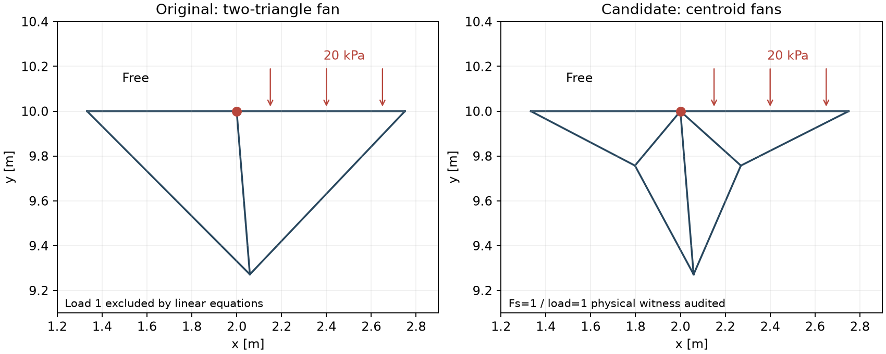

# D07A — 上載荷重端点で下界Fs探索が成立しない原因

G1R12の25ケース実Excel検証で確認した不具合です。製品VBAや実行中の25ケースの条件を変更した診断ではありません。

## 実際の失敗

D07Aはc=10 kPa、φ=ψ=25°の単層斜面に、x=2～8 mの天端上載圧20 kPaを加えたケースです。入力の面積158 m²、上載荷重合力−120 kN/m、点・材料・境界入力の読み戻しを確認してから実行しました。実Excelは`FS_LOWER_BRACKET_NOT_FOUND`、エラー番号5で終了し、最終Fsは取得できませんでした。解析部分392.88秒、準備等を含む411.70秒です。

このエラーは最初の入力準備で出た「材料を入力してください」とは別です。材料入力は正常で、下界探索の失敗が残りました。

## 同じメッシュでのPython検証

新しい診断用Excelコピーで同じ粗メッシュを生成しました。実ログと一致するTARGET=538、314節点、553要素です。荷重の切り替わる(2,10)に接続する三角形は2個だけで、斜めの内部辺1本を共有しています。(8,10)には3個が接続しています。

下界の釣合い・内部面力連続・外周面力条件に荷重倍率λ=1を加え、材料の降伏条件を入れずに独立したPythonの線形実行可能性問題を解きました。それだけで`PrimalInfeasible`となりました。正規化した矛盾証明は`max(abs(A.T @ z))=8.83e-14`、`b.T @ z=-1`です。証拠は[result.json](result.json)と[../diagnose_surcharge.py](../diagnose_surcharge.py)にあります。

さらに同じメッシュの通常の下界SOCPをPythonで解くと、λは約−3.09e-12、実質0でした。Excelだけの収束問題ではありません。

## 局所的な理由

天端の同じ節点で、片側は自由、片側は非ゼロの鉛直上載圧です。2個の三角形が斜めの内部辺1本だけで接すると、対称な応力差ΔSは内部面力連続から`ΔS = a t tᵀ`の形に限られます。内部辺の接線tは水平・鉛直のどちらでもありません。天端におけるΔSの水平面力差を0にするにはa=0が必要ですが、その場合は鉛直面力差も0になります。非ゼロの圧力段差を同時に表現できず、λ=0に制限されます。

これは有限要素の局所的な表現制約です。材料を強くしても、HSDの許容誤差を緩めても、線形境界条件の矛盾は解消できません。

## Pythonで試した対策

問題の2三角形だけをそれぞれ重心から3分割しました。2節点・4要素を追加し、557要素になりました。外周と圧力段差、材料定数、面積、自重、構成則は保持しています。

Fs=1、λ=1の場を得て、元の釣合い・面力・降伏式で独立監査しました。最大の正規化誤差は釣合い1.61e-11、内部面力3.32e-12、外周面力5.55e-17、降伏違反0です。正の自重・上載荷重を支える場があることを確認しました。

ただしこの固定FsのPython求解は`NumericalError`という終了状態を返しています。保存場自体の実行可能性は独立監査を通過しましたが、最適化収束やFs根探索の完了を合格とは扱いません。[candidate_repair.json](candidate_repair.json)に両方の判定を記録しています。この検証を25ケースの実Excel合格数へ加算しません。

## VBAでの対策案

1. メッシュ生成後に、面力の段差がある外周節点と接続する三角形数を検査する。
2. 外周が同一直線で、異なる指定面力が接し、2三角形だけの斜め内部辺が矛盾を生む場所を局所的に分割する。全モデルに一律の高密度化をかけない。
3. 現行の領域・材料・外周荷重割当を再構築し、モデル版を更新して古い下界モデル・順序・ブラケットとの誤再利用を防ぐ。raw荷重からの変換は現行の経路で1回だけ行う。
4. 同じ荷重条件でD07Aの全Fs探索を実Excelで再実行し、保存場監査・目標区間幅・保存出力を確認する。点順序とTARGETを変えた端点形状、均一荷重、無荷重、c=0の既存角修復も回帰対象にする。

既存の`RPX_RepairFreeCorners`は、c=0の三角形が2本の自由辺に接する別の問題を修復しています。今回の正のc・面力段差はその対象外なので、そこで直ったとは扱えません。現段階ではVBA未実装の対策案です。

50桁の再計算でも実行可能性を確認しました。[candidate_50digit_audit.json](candidate_50digit_audit.json)に元単位の残差を記録しています。初期診断の目標537・応力スケール5の記録はローカルのsuperseded_target537_scale5/へ保全し、ここでは実際の目標538・応力スケール10を使っています。
